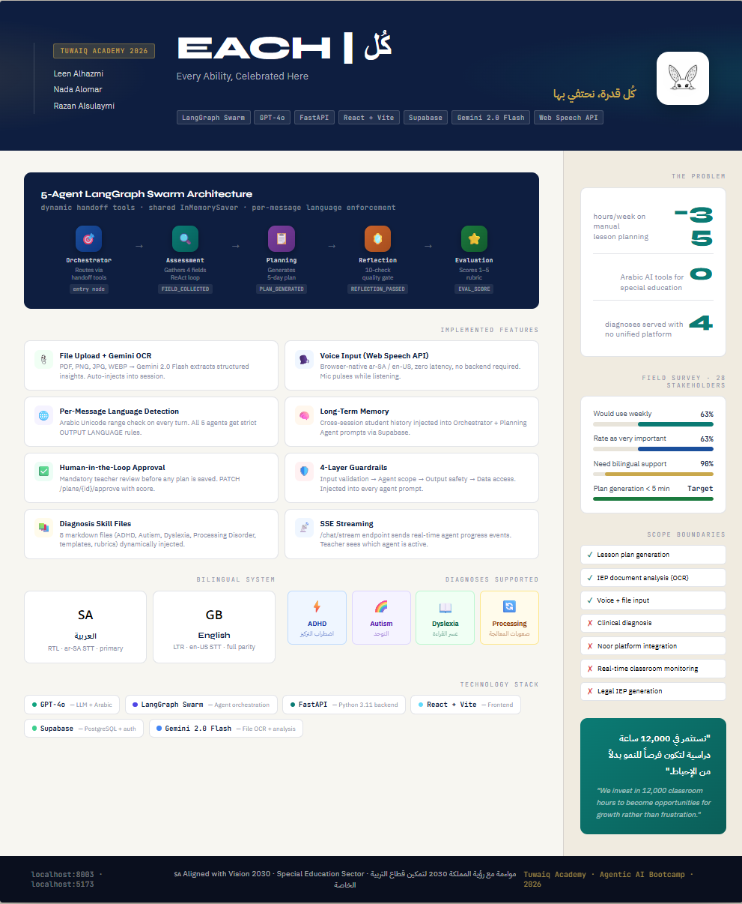

<p align="center">
  
</p>

<h1 align="center">EACH</h1>

<p align="center">
Every Ability, Celebrated Here
</p>

<p align="center">
Agentic AI system for personalized special education planning
</p>

---

# Overview

**EACH** is an agentic AI platform designed to assist special education teachers in creating **personalized weekly learning plans** for students with diverse learning needs.

The system focuses on supporting learners with:

- ADHD
- Autism Spectrum Disorder
- Dyslexia
- Processing Disorders
- Attention and engagement challenges

Instead of relying on a single chatbot response, EACH uses a **multi-agent architecture** where specialized AI agents collaborate to analyze student needs, generate structured plans, review plan quality, and record teacher feedback.

---

# Agent Architecture

EACH uses a **LangGraph Swarm architecture** where different agents collaborate in a structured workflow.

| Agent | Role | Description |
|------|------|-------------|
| **Orchestrator** | Router | Routes teacher requests to the appropriate agent |
| **Assessment Agent** | Context Collector | Collects difficulty, triggers, strategies tried, and support needs |
| **Planning Agent** | Plan Generator | Generates structured weekly learning plans |
| **Reflection Agent** | Quality Reviewer | Reviews and improves generated plans |
| **Evaluation Agent** | Plan Scorer | Records teacher approval and evaluation score |

---
# System Workflow

```
Teacher Message
      ↓
   Orchestrator
      ↓
 Assessment Agent
      ↓
   Planning Agent
      ↓
 Reflection Agent
      ↓
 Teacher Approval
      ↓
 Evaluation Agent
```

This workflow ensures that plans are **context-aware, reviewed, and evaluated** instead of generated in a single step.

---

# Key Features

| Feature | Description |
|------|-------------|
| **Multi-Agent Planning** | Structured AI workflow instead of a single chatbot |
| **Diagnosis-Aware Planning** | Uses diagnosis-specific skill files |
| **Session Memory** | Maintains student context across conversations |
| **Long-Term Memory** | Stores past plans, milestones, and progress |
| **Plan Quality Review** | Reflection agent validates plan quality |
| **Human-in-the-Loop Approval** | Teachers must approve plans before they are finalized |
| **Teacher Evaluation** | Plans can be approved and scored |
| **Document Analysis** | Uploaded IEP or homework files can be analyzed |
| **Arabic & English Support** | Responses adapt to teacher language |
| **Streaming Responses** | Real-time agent progress updates via `/chat/stream` |

---

# Backend Architecture

| Component | Description |
|--------|-------------|
| **FastAPI Backend** | Main backend API powering chat, planning, evaluation, and file analysis |
| **LangGraph Swarm** | Multi-agent orchestration system |
| **LangChain** | LLM integration and prompt execution |
| **Supabase Database** | Stores students, sessions, plans, milestones, and logs |
| **OpenAI GPT Models** | Used for orchestration, planning, reflection, and evaluation |
| **Gemini Flash** | Used for document OCR and structured file analysis |
| **Skill Files** | Diagnosis-specific knowledge files used by the planning agent |
| **Memory System** | Maintains context and long-term student learning history |

---

# Frontend

| Component | Technology |
|----------|-------------|
| UI Framework | React + Vite |
| Styling | Tailwind CSS |
| Chat Interface | Real-time agent conversation |
| Voice Input | Web Speech API |
| State Handling | React state + API integration |

---

# Technology Stack

| Layer | Technology |
|------|-------------|
| LLM | GPT-4o |
| Agent Framework | LangGraph Swarm |
| Backend | FastAPI |
| Frontend | React + Vite |
| Database | Supabase |
| OCR / File Analysis | Gemini 2.0 Flash |
| Voice Input | Web Speech API |

---

## Project Poster

<p align="center">
  
</p>

<p align="center">
<strong>EACH — Every Ability, Celebrated Here</strong><br>

The poster illustrates the complete system architecture, including the multi-agent workflow, implemented platform features, supported diagnoses, bilingual capabilities, and the technology stack behind the EACH system.

---
